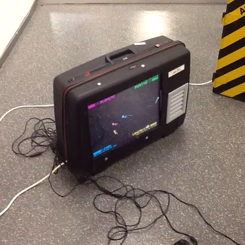
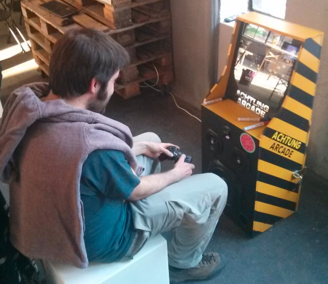

# FLIPER!

A idéia é construir um pequeno arcade que possa ser transportado e montado por uma pessoa sem maiores dificuldades. Barato, de fácil manutenção/extensão e o mais livre possível. Tudo usado para criar o fliper vai ser disponibilizado para uso de outras pessoas que queiram criar o seu: software, planos de hardware, manuais de como montar.

Para financiar o desenvolvimento do projeto e o custo de montar a primeira unidade, seria criado um projeto no **Catarse**. Quanto mais barato o custo desse projeto, melhor: a idéia é chegar num protótipo bem documentado e pronto. Daí pra frente, é outra história.

---

### Liberdade

Na medida do possível, serão usadas tecnologias livres. Quanto mais aberto, melhor, mas mantendo o sistema acessível para jogadores e criadores. O código, software e lista de materiais usados no fliper, assim como suas instruções de montagem, serão disponibilizadas de graça e aberto a todos.

### Possíveis usos

1. Jogar em público / na rua / chamar gente
2. Oficinas abertas de fazer jogos
3. Protestos, ocupações, intervenções
4. Eventos em geral

### Jogos

Os jogos nesse fliper seriam jogos independentes, feitos tanto por brasileiros quanto por estrangeiros. O projeto não tem nenhuma preocupação em restringir quais jogos vão rodar em cada fliper. Isso é a cargo de quem montar/usar.

O fliper não conta com nenhum mecanismo para cobrar pelos jogos. Isso fica a cargo de cada pessoa que montar o seu. A versão inicial (protótipo do Catarse) só vai ter jogos gratuitos e não vai cobrar nem para jogadores nem para criadores colocarem seus jogos no sistema.

---

## Inspiração

Coisas como o Luggatron e o [Achtung Arcade](http://achtungarcade.com/).

---

## Por que fazer um Catarse?

Desenvolver um arcade tem seu custo material, especialmente por ainda não sabermos exatamente como ele vai ser. Por enquanto estão aqui apenas algumas idéias soltas.

1. O projeto do fliper é livre, mas podemos usar o acesso prévio ao projeto como "exclusivo". Quando em alfa, o acesso ao projeto poderia ser só para apoiadores. É uma idéia, mas é um pouco "não-transparente""."

2. Criar uma camada de recompensas (com poucos disponíveis) em que a pessoa pode pagar o preço de um fliper e mais um bônus para receber um fliper pronto. Assim, ela financia o desenvolvimento do projeto e leva uma cópia para ela.

